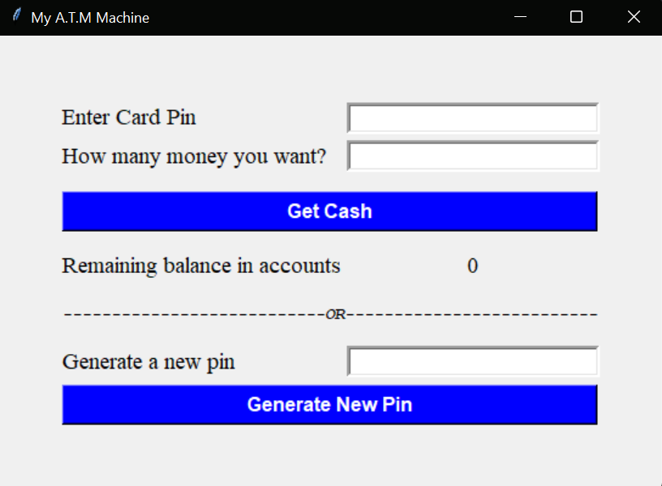
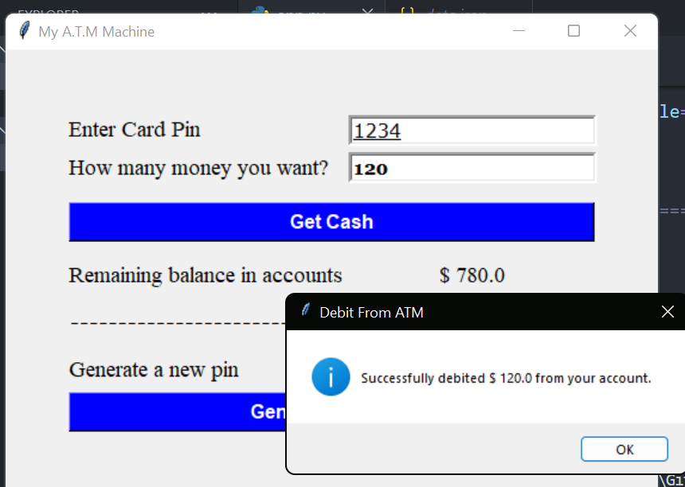

# ATM Machine

## Description

This ATM Machine application is a simple Python-based simulation using Tkinter for the graphical user interface. It allows users to manage ATM transactions such as withdrawing cash and generating new ATM PINs. The application reads and writes data to a JSON file, which contains information about ATM cash reserves and user accounts. 

Key features include:
- **Cash Withdrawal**: Users can withdraw cash from their accounts by providing a valid PIN and specifying the amount.
- **PIN Generation**: Users can generate a new ATM PIN and initialize a new account with a default balance.
- **Balance Display**: Displays the remaining balance in the user’s account after a successful transaction.

## Project Structure

- `img/`: Directory for image assets.
    - `img1.png`: Preview image 1
    - `img2.png`: Preview image 2
- `data.json`: Stores ATM pin and account balance.
- `app.py`: The main application file containing all the ATM logic.
- `README.md`: This file.

## Preview

Below are previews of the images used in the project:

### ATM Machine Interface


### ATM Machine successfully transaction


## Installation

### Prerequisites

- Python 3.x
- Pip (Python package installer)

### Setup

1. **Clone the Repository**

   ```bash
   git clone https://github.com/yourusername/your-repository.git
   cd your-repository